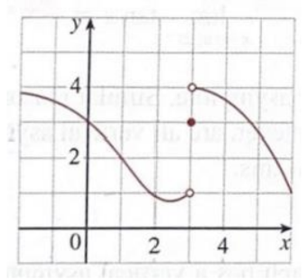
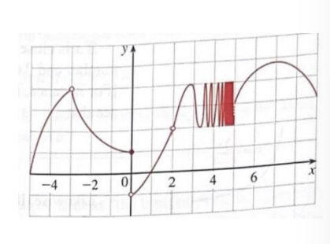
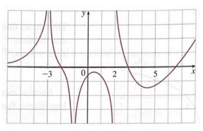

# Homework

2024.09.23

## Exercise 1 : For the function $\ f$ whose graph is given, state the value of each quantity, if it exists. If it does not exist, explain why.

*exist : 存在

(a) $\ \lim \limits_{x \to 1} f(x) \Rightarrow 2$

(b) $\ \lim \limits_{x \to 3^-} f(x) \Rightarrow 1$

(c) $\ \lim \limits_{x \to 3^+} f(x) \Rightarrow 4$

(d) $\ \lim \limits_{x \to 3} f(x) \Rightarrow \lim \limits_{x \to 3^+} f(x) = 4 \neq \lim \limits_{x \to 3^-} f(x) = 1 \Rightarrow$ DNE

(e) $\ f(3) \Rightarrow 3$

## Exercise 2 : For the function $\ h$ whose graph is given, state the value of each quantity, if it exists. If it does not exist, explain why.

(a) $\ \lim \limits_{x \to 3^-} h(x) \Rightarrow 4$

(b) $\ \lim \limits_{x \to 3^+} h(x) \Rightarrow 3$

(c) $\ \lim \limits_{x \to -3} h(x) \Rightarrow 4$

(d) $\ h(-3) \Rightarrow$ DNE

(e) $\ \lim \limits_{x \to 0^-} h(x) \Rightarrow 1$

(f) $\ \lim \limits_{x \to 0^+} h(x) \Rightarrow -1$

(g) $\ \lim \limits_{x \to 0} h(x) \Rightarrow \lim \limits_{x \to 0^+} h(x) = -1 \neq \lim \limits_{x \to 0^-} h(x) = 1 \Rightarrow$ DNE

(h) $\ h(0) \Rightarrow 1$

(i) $\ \lim \limits_{x \to 2} h(x) \Rightarrow 2$

## Exercise 3 : For the function $\ A$ whose graph is shown, state the following.

(a) $\ \lim \limits_{x \to -3} A(x) \Rightarrow \infty$

(b) $\ \lim \limits_{x \to 2^-} A(x) \Rightarrow -\infty$

(c) $\ \lim \limits_{x \to 2^+} A(x) \Rightarrow \infty$

(d) $\ \lim \limits_{x \to -1} A(x) \Rightarrow -\infty$

(e) The equations of the vertical asymptotes

$\ \begin{cases}
\lim \limits_{x\to -3^-} A(x) = \infty\\
\lim \limits_{x\to -3^+} A(x) = \infty\\
\lim \limits_{x\to -1^-} A(x) = -\infty\\
\lim \limits_{x\to -1^+} A(x) = -\infty\\
\lim \limits_{x\to 2^-} A(x) = -\infty\\
\lim \limits_{x\to 2^+} A(x) = \infty
\end{cases}$
