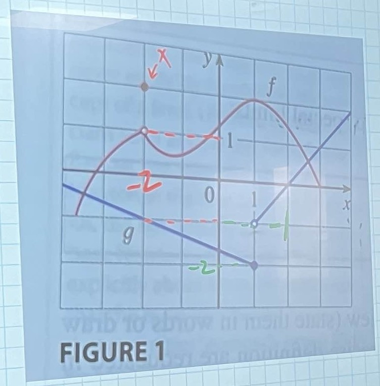

# 2.3 Calculatin Limits Using the Limit Laws
2024.09.18

## Limit Laws

Suppose that $\ c$ is a constant and the linits $\ \lim \limits_{x\to a}f(x)$ and $\ \lim \limits_{x\to a}g(x)$ exist.

### 1. Sum Law

$\ \lim \limits_{x\to a}[f(x)+g(x)] = \lim \limits_{x \to a}f(x) + \lim \limits_{x\to a}g(x)$

### 2. Difference Law

$\ \lim \limits_{x\to a}[f(x)-g(x)] = \lim \limits_{x \to a}f(x) - \lim \limits_{x\to a}g(x)$

### 3. Constant Law

$\ \lim \limits_{x\to a}[cf(x)] = c \times \lim \limits_{x \to a}f(x)$

### 4. Product Law

$\ \lim \limits_{x\to a}[f(x)g(x)] = \lim \limits_{x \to a}f(x) \times \lim \limits_{x\to a}g(x)$

### 5. Quotient Law

$\ \lim \limits_{x\to a}[\frac{f(x)}{g(x)}] = \frac{\lim \limits_{x \to a}f(x)}{\lim \limits_{x\to a}g(x)}$ , if $\ \lim \limits_{x\to a}g(x)	\neq 0$

### 6. Power Law

$\ \lim \limits_{x\to a}[f(x)]^n = [\lim \limits_{x\to a}f(x)]^n$, when n is positive integer.

### 7. Root Law

$\ \lim \limits_{x\to a} \sqrt[n]{f(x)} = \sqrt[n]{\lim \limits_{x\to a}f(x)}$, when n is positive integer.

### 8. $\ \lim \limits_{x\to a} c = c$

### 9. $\ \lim \limits_{x\to a} x = a$

### 10. $\ \lim \limits_{x\to a} x^n = a^n$

### 11. $\ \lim \limits_{x\to a} \sqrt[n]{x} = \sqrt[n]{a}$

## e.g.1 Use the Limit Laws and the graph to evaluate

(a) $\ \lim \limits_{x\to -2}[f(x)+5g(x)]$

$\ = \lim \limits_{x\to -2}f(x)+\lim \limits_{x\to -2}5g(x) = 1+(-5) = -4$

(b) $\ \lim \limits_{x\to 1}[f(x)+g(x)]$

$\ \because \lim \limits_{x\to 1^-}g(x) = -2 \neq \lim \limits_{x\to 1^+}g(x) = -1$

$\ \Rightarrow \because \lim \limits_{x\to 1}g(x)$ DNE

$\ \Rightarrow \lim \limits_{x\to 1}[f(x)+g(x)]$ DNE

(c) $\ \lim \limits_{x\to 2}[\frac{f(x)}{g(x)}]$

$\ = \frac{\lim \limits_{x\to 2}f(x)}{\lim \limits_{x\to 2}g(x)}$

$\ \because \lim \limits_{x\to 2^-}g(x) = -0 \neq \lim \limits_{x\to 2^+}g(x) = 0$

$\ \Rightarrow \lim \limits_{x\to 2}g(x)$ DNE

$\ \Rightarrow \lim \limits_{x\to 2}[\frac{f(x)}{g(x)}]$ DNE

## $\ \sum$ Sigma

$\ 1^2+2^2+3^2+\cdots+n^2 = \sum_{k=1}^n k^2$

(1) $\ \sum_{k=1}^n k = \frac{n(n-1)}{2}$

(2) $\ \sum_{k=1}^n k^2 = \frac{n(n-1)}{2}(2n+1)\frac{1}{3} = \frac{n(n-1)(2n+1)}{6}$

(3) $\ \sum_{k=1}^n k^3 = [\frac{n(n-1)}{2}]^2$

## e.g.2 Evaluate the following limits and justify each step.

(a) $\ \lim \limits_{x\to 5}(2x^2-3x+4)$

$\ \Rightarrow \lim \limits_{x\to 5}2x^2 - \lim \limits_{x\to 5}3x + \lim \limits_{x\to 5}4 \leftarrow$ 1. + 2.

$\ \Rightarrow 2\lim \limits_{x\to 5}x^2 - 3\lim \limits_{x\to 5}x + 4 \leftarrow$ 3. + 8.

$\ \Rightarrow 2(5^2) - 3(5) + 4 \leftarrow$ 9. + 10.

(b) $\ \lim \limits_{x\to -2}\frac{x^3+2x^2-1}{5-3x}$

$\ \Rightarrow \frac{\lim \limits_{x\to -2} x^3+2x^2-1}{\lim \limits_{x\to -2} 5-3x} \leftarrow$ 5.

$\ \Rightarrow \frac{\lim \limits_{x\to -2} x^3+2\lim \limits_{x\to -2}x^2-\lim \limits_{x\to -2}1}{\lim \limits_{x\to -2} 5-3\lim \limits_{x\to -2}x} \leftarrow$ 1. + 2. + 3.

$\ \Rightarrow \frac{(-2)^3+2(-2)^2-1}{5-3(-2)} \leftarrow$ 8. + 9. + 10.

$\ \Rightarrow \frac{(-8)+8-1}{5+6} = -\frac{1}{11}$

## Direct Substi stution Property

直接帶入法

If $\ f$ is a polynormial or a rational function and $\ a$ is in the domain of $\ f$, then :

$$\ \lim \limits_{x\to a} f(x) = f(a)$$

*polynormial : 多項式 , *rational : 分式

## e.g.3 Find $\ \lim \limits_{x\to 1} \frac{x^2-1}{x-1}$

$\ \Rightarrow \lim \limits_{x\to 1} \frac{(x-1)(x+1)}{x-1} = \lim \limits_{x\to 1}x+1 = 2$

*If $\ f(x) = g(x)$ when $\ x \neq a$, then $\ \lim \limits_{x\to a}f(x) = \lim \limits_{x\to a}g(x)$, provided the limits exist.